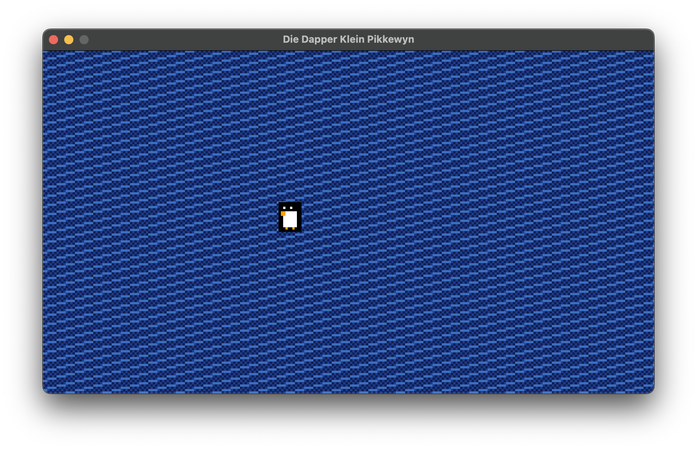

## Die Dapper Klein Pikkewyn

### Description

This game is a work in progress. And will be for a very long time. It's designed to be played primarily by children.

#### Overview:

Top-down, pixel art RPG in the general artistic style of Pokémon Red.

#### Story:

The game follows a small, but brave little African penguin, as he attempts to save his colony from starvation at the
hands of Chinese fishing vessels off the Cape. Jan de Pikkewyn (working name) will utilize various weapons and
eventually armor in his quest to defeat the Chinese sailors and sink their ships.

#### Mechanics:

Starting-tier weapons will be something like discarded fishing hooks, progressing to shells, sea urchins, etc.,
eventually ending with full armor. The gameplay will be more similar to JRPGs like Final Fantasy and Time Stalkers, with
movement spots for both sides, as well as party members.
Jan can add party members such as other penguins and seals, and call upon larger marine life for one-off aid with
sinking ships, knocking sailors off the deck, etc.
The ships progressively get harder (more sailors, more advanced weaponry, etc.)

#### Technical:

I'm going to attempt to program this in C, using the raylib library.

-------

### Features

- $(Game Feature 01)
- $(Game Feature 02)
- $(Game Feature 03)

### Controls

Keyboard:

- $(Game Control 01)
- $(Game Control 02)
- $(Game Control 03)

### Screenshots

_TODO: Show your game to the world, animated GIFs recommended!._

### Developers

- $(Developer 01) - $(Role/Tasks Developed)
- $(Developer 02) - $(Role/Tasks Developed)
- $(Developer 03) - $(Role/Tasks Developed)

### Links

- YouTube Gameplay: $(YouTube Link)
- itch.io Release: $(itch.io Game Page)
- Steam Release: $(Steam Game Page)

### License

This game sources are licensed under an unmodified zlib/libpng license, which is an OSI-certified, BSD-like license that
allows static linking with closed source software. Check [LICENSE](LICENSE) for further details.

$(Additional Licenses)

*Copyright (c) 2025 Benjamin Himes (@chrischansonichu)*
